<h1> Setting up Google Analytics and Google Tag Manager</h1>

<h2> Google Analytics</h2>

1.  Set up a GA account by navigating to https://analytics.google.com and clicking sign up.

    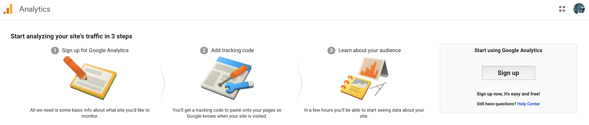

2.  "Account Setup": enter in a name for the account
    
    "What do you want to measure": click Web
    
    "Property Setup": enter in a name for the website and it's URL then click Create

    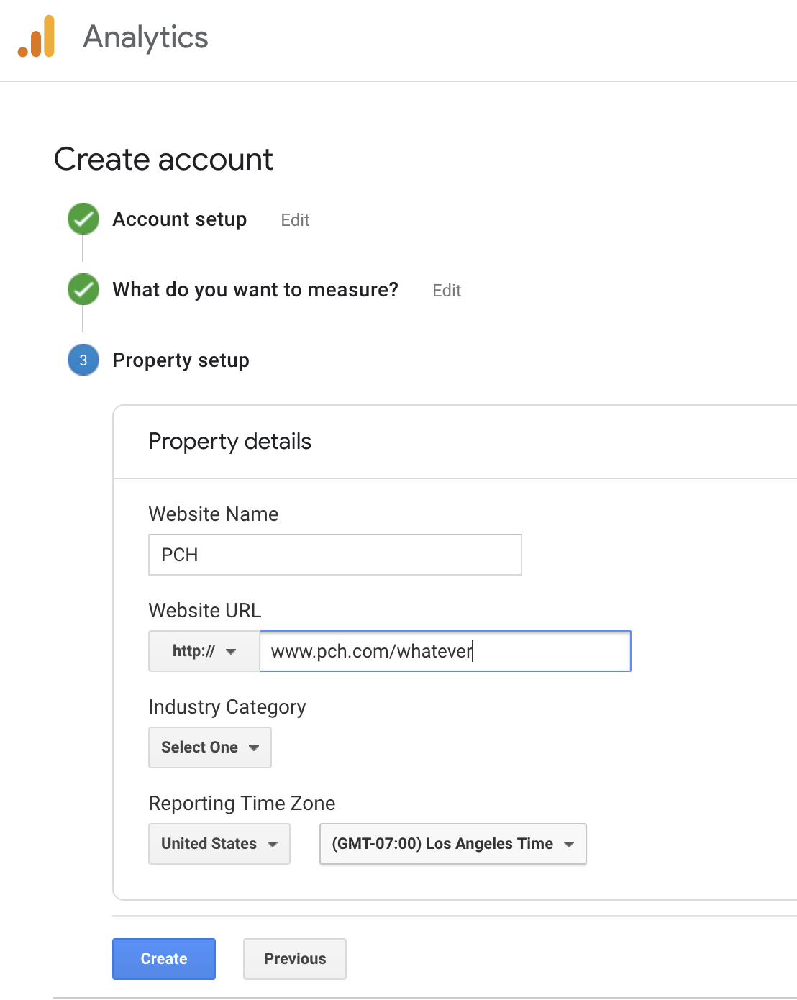

3.  Take note of the Google Analytics Tracking ID for later use.

    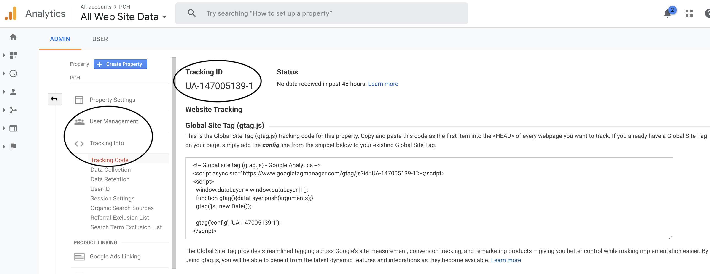

<h2> Google Tag Manager</h2>

<h3> Creating a Container </h3>

1.  Navigate to https://tagmanager.google.com

2.  Create a new container by clicking the 3 dots on the righthand side of the page:

    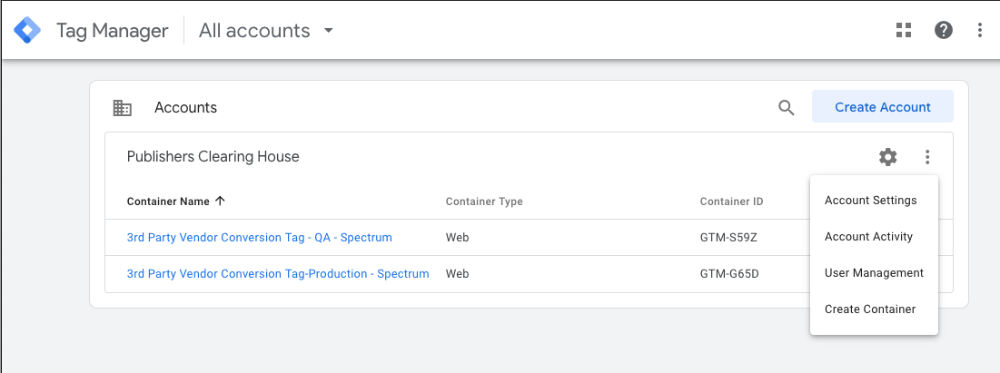

3.  Enter in a name and select web and click Create:

    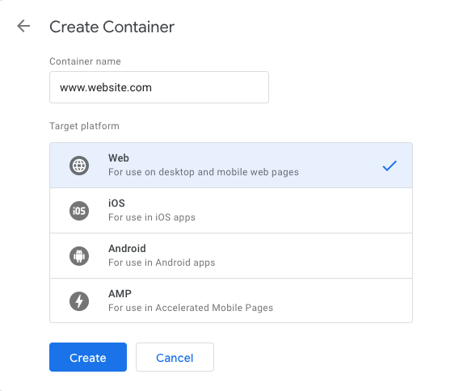

4.  You will be prompted with a modal to insert code to the head and body of the page you will be integrating the tag.  

    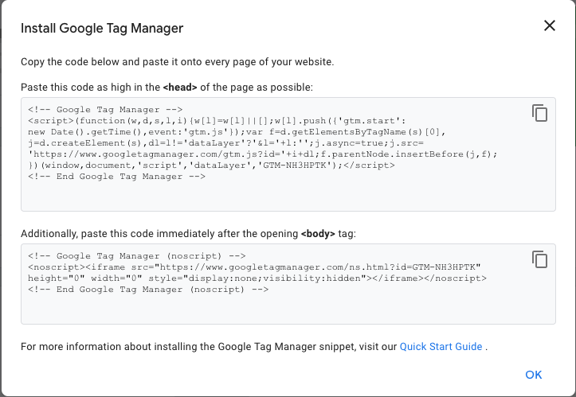

<h3> Adding a Tag to Track Page Views </h3>

1.  Click 'Add a new tag'

    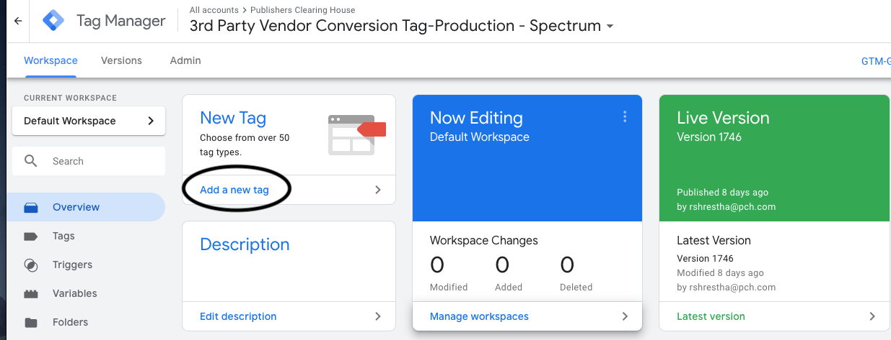

2.  Name the tag then click anywhere in the top "Tag Configuration" box to choose a tag type.

    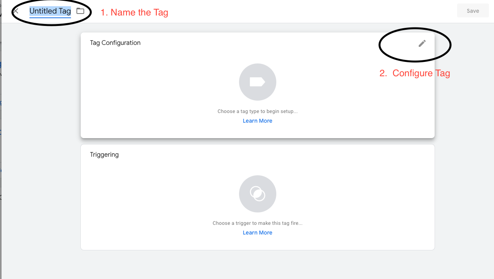

3.  There are several tag types but for tracking page views, Universal Analytics will often be the best selection.  

    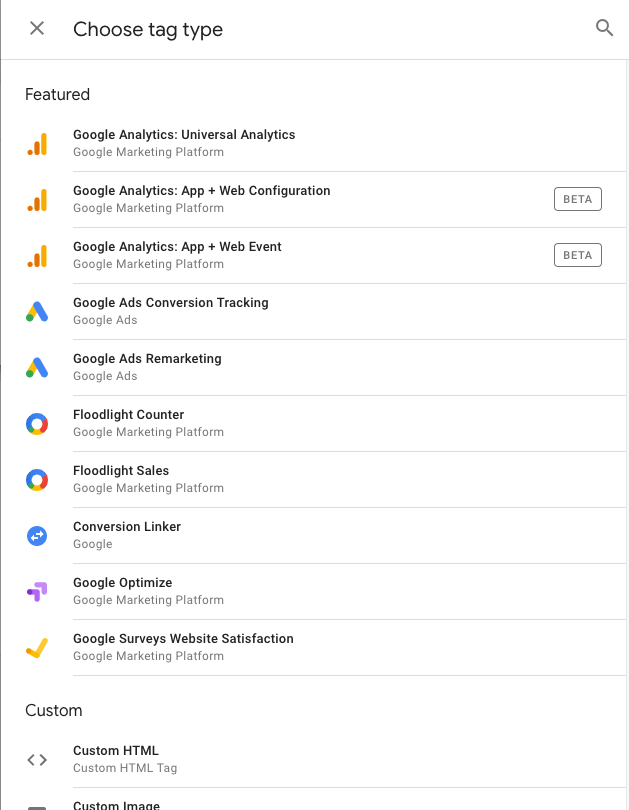

4.  Under the "Track Type" dropdown, select Page view
5.  Under the "Google Analytics Settings" dropdown, select New Variable

    

6.  To allow the tag to be tracked by Google Analytics, enter in the Google Analytics Tracking ID previously mentioned above.

    

    * Cookie Domain: If you have no other Google Analytics tags deployed on your site, you should leave this value set to "auto".
     
    * If you have other Google Analytics tags setup on your site or in Tag Manager, you should confirm that the Cookie Domain value is consistent.

7.  Next, click on "Triggering" and click on All Pages

    * This will fire every time someone views any of the web pages in the domain.  
    

8.  Click save

<h2> Finalizing Setup </h2>

1.  Once finished, click preview to ensure the tag is firing properly.

    

2.  If satisfied, click submit, then enter a version name and version description and finally click Publish.

    

3.  Google Tag Manager will direct you to the Versions tab with a summary of changes

    

<h3> Adding a Tag With Custom HTML </h3>

1.  Click 'Add a new tag'

    

2.  Name the tag then click anywhere in the top "Tag Configuration" box to choose a tag type.

    

3.  Click Custom HTML 

    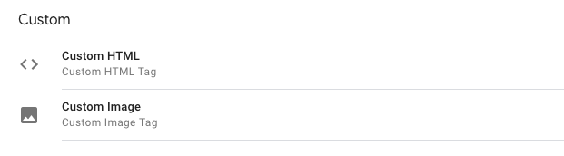

4.  Enter the custom script into the field

    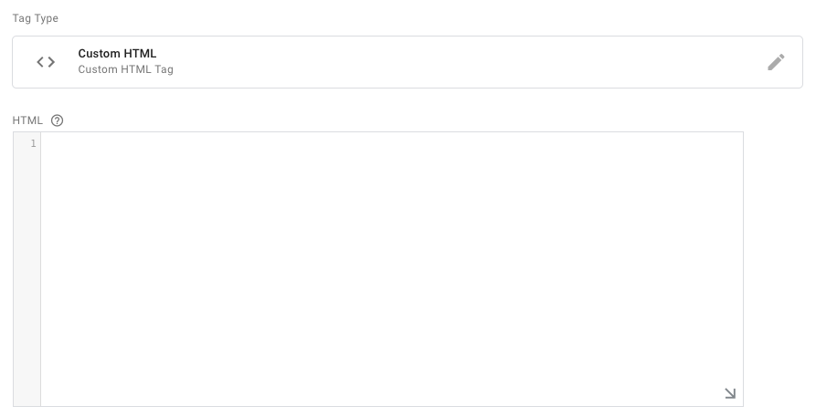

5.  Take note of advanced settings that you may want to apply

    * Tag firing options - Once per event vs Once per page     
    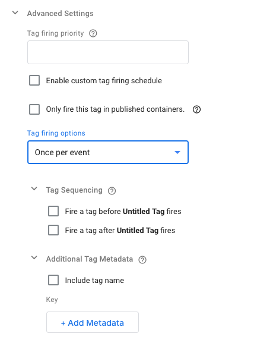

<h3> Adding a Tag With Custom Image URL </h3>

1.  Click 'Add a new tag'

    

2.  Name the tag then click anywhere in the top "Tag Configuration" box to choose a tag type.

    

3.  Click Custom Image

    

4.  Enter the URL into the field and take note of any advanced settings to apply

    

<h3> Adding a custom trigger </h3>
    

1.  Click the plus sign at the upper right hand corner

    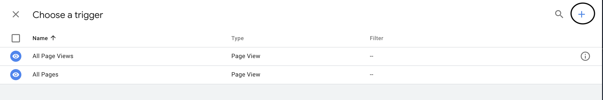

2.  Name the trigger you want to create then click anywhere on "Trigger Configuration"

    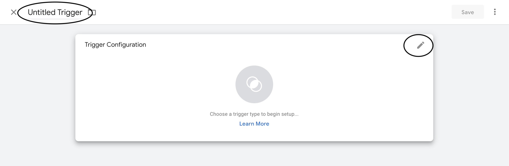

3.  Choose the trigger type you would like to implement

    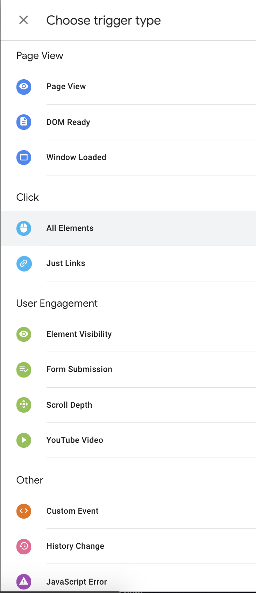
